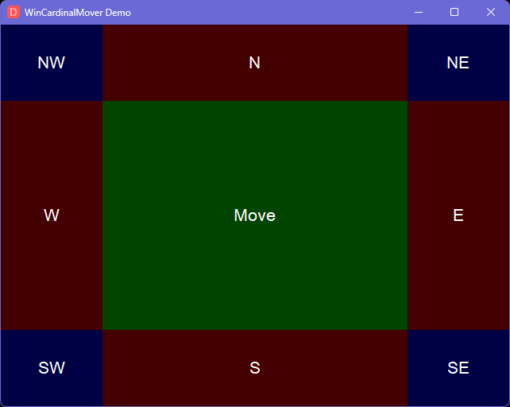

# WinCardinalMover
Provides window moving, resizing, and snapping from anywhere within a window. Constrains to monitor edges, does NOT SUPPORT multiple monitors yet.

The center of the window is assigned to moving the window. The first 20% from the inner edge of each window is assigned to resizing based on the cardinal directions:  N, S, W, E, NE, SE, NW, and SW. Double clicking each region with your defined hotkey will initiate an aero snap like feature.

<p align="center" width="100%"></p>

 ## Motivation
 I grew tired of needing to be super accurate with my mouse when resizing windows. Thinner window borders and higher resolutions have exacerbated the issue.

## Demo
Try it out yourself. Run the included `demo.ahk` file for a GUI which dynamically shows the active hotkey regions.

 ## Example Usage
The "forward" mouse button on your mouse will activate WinCardinalMover. Holding `Ctrl` after first holding `XButton2` will add taskbar constraining. Double clicking `XButton2` will trigger the corresponding snap region.
 ```ahk
#Requires AutoHotkey v2
#Include <ahk-wincardinalmove\WinCardinalMover>

XButton2::WinCardinalMover("XButton2", "Ctrl")
```
Do you want customized snaps? With  `WinCardinalMover.snap` you can override the default `WinMove` math behind the `move` and cardinal regions.

The 2nd paramter of `.snap` is a `callback` so you could also execute other random bits of code on snapping if you wanted. As long as you always return `[x,y,w,h]` it'll just work.
```ahk
#Requires AutoHotkey v2
#Include <ahk-wincardinalmove\WinCardinalMover>

WinCardinalMover
  .snap("north", (this) => [
    this.HALF_WIDTH / 2, ;x
    this.win.offsets.top, ;y
    this.HALF_WIDTH, ;width
    this.HALF_HEIGHT ;height
  ])
  .snap("south", (this) => [
    this.HALF_WIDTH / 2,
    this.HALF_HEIGHT - this.win.offsets.bottom,
    this.HALF_WIDTH,
    this.HALF_HEIGHT - this.TASKBAR_HEIGHT
  ])
  .snap("southeast", (this) => [
    this.HALF_WIDTH,
    this.HALF_HEIGHT,
    this.HALF_WIDTH - this.win.offsets.right,
    this.HALF_HEIGHT - this.TASKBAR_HEIGHT
  ])

XButton2::WinCardinalMover("XButton2")
```
If you prefer, you could keep these `.snap` customizations really simple like this:
```ahk
WinCardinalMover.snap("move", (*) => [0,0,1920,1080])
```
